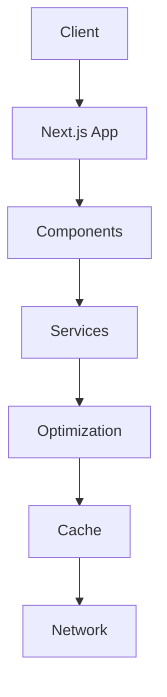

# Documentation Technique Dark Data Labs

## 🏗️ Architecture

### Structure du Projet
```
Dark-Data-Labs/
├── app/                    # Pages et routage Next.js
├── components/            # Composants React
│   ├── ui/               # Composants d'interface
│   ├── sections/         # Sections de page
│   └── form/            # Composants de formulaire
├── services/             # Services d'optimisation
├── hooks/               # Hooks personnalisés
├── contexts/            # Contextes React
├── styles/              # Styles globaux
└── public/              # Ressources statiques
```

### Flux de Données


## 🛠️ Services

### ImageOptimizationService

Service de gestion et d'optimisation des images.

```typescript
interface OptimizationConfig {
  formats: ('webp' | 'avif' | 'jpeg')[];
  sizes: Array<{ width: number; suffix: string }>;
  quality?: number;
  metadata?: boolean;
}

class ImageOptimizationService {
  async optimizeImage(
    src: string,
    config: OptimizationConfig
  ): Promise<OptimizationResult>;
}
```

### AdvancedCacheService

Service de mise en cache à deux niveaux.

```typescript
interface CacheConfig {
  name: string;
  version: number;
  maxAge: number;
  maxItems?: number;
}

class AdvancedCacheService {
  async configureCacheStore(config: CacheConfig): Promise<void>;
  async cacheResource(
    cacheName: string,
    resource: string,
    response?: Response
  ): Promise<void>;
}
```

### FontOptimizationService

Service d'optimisation des polices.

```typescript
interface FontConfig {
  family: string;
  variants: FontVariant[];
  display: string;
  preload?: boolean;
}

class FontOptimizationService {
  async injectOptimizedFonts(configs: FontConfig[]): Promise<void>;
}
```

### ThirdPartyOptimizationService

Service de gestion des scripts tiers.

```typescript
interface ScriptConfig {
  src: string;
  priority: 'critical' | 'high' | 'medium' | 'low';
  defer?: boolean;
  async?: boolean;
}

class ThirdPartyOptimizationService {
  async configureScript(config: ScriptConfig): Promise<void>;
}
```

## 🧩 Composants

### EnhancedImage

Composant d'image optimisé.

```typescript
interface EnhancedImageProps {
  src: string;
  alt: string;
  width: number;
  height: number;
  priority?: boolean;
  loading?: 'eager' | 'lazy';
  placeholder?: 'blur' | 'empty';
}
```

### OptimizedSection

Section avec chargement optimisé.

```typescript
interface OptimizedSectionProps {
  priority: 'high' | 'medium' | 'low';
  animation?: 'fade' | 'slide';
  className?: string;
  children: React.ReactNode;
}
```

## 🎯 Optimisations

### Stratégies de Chargement

1. **Images**
   - Compression adaptative
   - Formats modernes (WebP, AVIF)
   - Chargement progressif
   - Redimensionnement intelligent

2. **Polices**
   - Chargement adaptatif
   - Sous-ensembles optimisés
   - Préchargement intelligent
   - Formats modernes (WOFF2)

3. **Cache**
   - Cache hybride
   - Invalidation intelligente
   - Préchargement
   - Gestion de la taille

4. **Scripts**
   - Chargement différé
   - Isolation sécurisée
   - Analytics optimisés
   - Respect de la vie privée

## 🧪 Tests

### Tests de Performance

```typescript
describe('Performance Tests', () => {
  test('Lighthouse audit', async () => {
    const results = await lighthouse(url, {
      onlyCategories: ['performance']
    });
    expect(results.score).toBeGreaterThan(90);
  });
});
```

### Tests de Charge

```typescript
describe('Load Tests', () => {
  test('Concurrent users', async () => {
    const users = 10;
    const results = await loadTest(users);
    expect(results.avgResponseTime).toBeLessThan(3000);
  });
});
```

## 📊 Monitoring

### Métriques Clés

1. **Web Vitals**
   - LCP (Largest Contentful Paint)
   - FID (First Input Delay)
   - CLS (Cumulative Layout Shift)

2. **Performance**
   - Temps de chargement
   - Taille des ressources
   - Taux de compression

3. **Cache**
   - Taux de succès
   - Temps de réponse
   - Utilisation mémoire

## 🔒 Sécurité

### Bonnes Pratiques

1. **Scripts Tiers**
   - Isolation dans des iframes
   - Vérification d'intégrité
   - Politique de sécurité

2. **Cache**
   - Nettoyage périodique
   - Validation des données
   - Limites de taille

3. **Ressources**
   - Validation des formats
   - Sanitization des entrées
   - Protection contre les attaques

## 📈 Performance

### Objectifs

- Score Lighthouse > 90
- LCP < 2.5s
- FID < 100ms
- CLS < 0.1

### Optimisations

1. **Réseau**
   - Compression adaptative
   - Mise en cache intelligente
   - Préchargement sélectif

2. **Rendu**
   - Chargement différé
   - Virtualisation
   - Optimisation des animations

3. **Resources**
   - Optimisation des images
   - Optimisation des polices
   - Bundling intelligent
